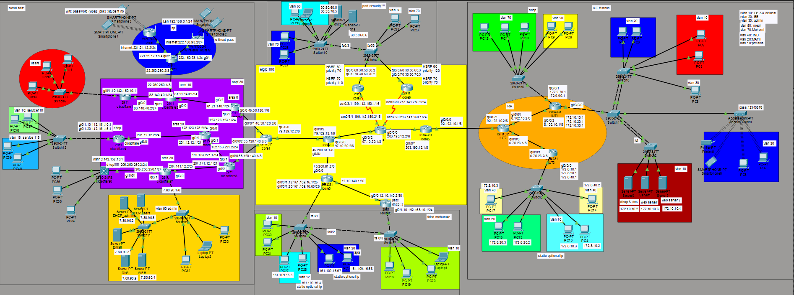

# 🎓 University Network Design Lab Project  
### Cisco Packet Tracer Implementation  
_Isfahan University of Technology (IUT) – Semester 5 Network Lab_

---

## 🖼️ Full Network Topology

  

> Complete enterprise-level topology including IUT Campus, Core Backbone, Cloudflare Segment, and Foolad Mobarakeh Industrial Network.

---

## 📌 Project Overview

This project is a comprehensive enterprise-level network design and implementation developed using **Cisco Packet Tracer**.

The topology simulates a multi-site enterprise architecture consisting of:

- 🏫 IUT Campus Network  
- 🌐 Cloudflare Network Segment  
- 🏭 Foolad Mobarakeh Industrial Network  
- 🟡 Core routing backbone connecting all sections  

The project demonstrates practical implementation of:

- VLAN segmentation  
- Inter-VLAN routing  
- Dynamic routing protocols (RIP, EIGRP, OSPF)  
- HSRP redundancy  
- PAT (NAT Overload)  
- DHCP, DNS, Web, and Email services  
- SSH secure management  
- Wireless networking  
- ACL-based firewall policies  

---

# 🏫 1️⃣ IUT Campus Network

This section represents the internal university network of **Isfahan University of Technology (IUT)**.

## 🔹 VLAN Structure

| VLAN ID | Department |
|----------|------------|
| 10 | CE & Servers |
| 20 | EE |
| 30 | Admin |
| 40 | IND |
| 70 | MCHEMI |
| 90 | MECH |
| 20 | MATH |
| 10 | Physics |

Each VLAN is configured on access switches and connected via trunk links to routers for inter-VLAN routing.

## 🔹 Routing Protocol
- RIP (Routing Information Protocol) is used for internal routing in this section.

## 🔹 Network Services
- DHCP Server  
- DNS Server  
- Web Server  
- Admin Web Server (Protected by ACL Firewall Rules)

The Admin Web Server is protected so that only the Admin VLAN can access it.

## 🔹 Wireless Network
- Access Point-PT deployed in VLAN 20  
- Wireless clients connected  
- IP assignment via DHCP  

## 🔹 Security
- SSH enabled on selected routers  
- VLAN isolation  
- ACL-based firewall protection  

---

# 🟡 2️⃣ Core Backbone Network

This section connects:

- IUT Campus  
- Cloudflare Network  
- Foolad Mobarakeh Network  

## 🔹 Routing Protocol
- EIGRP is implemented in the core network.

## 🔹 High Availability
- HSRP (Hot Standby Router Protocol) configured on upper core routers.
- Priority values configured for active/standby roles.
- Provides default gateway redundancy.

## 🔹 NAT Configuration
- PAT (Port Address Translation) configured on the router connected to Foolad Mobarakeh.
- Private IP addresses translated to a public IP.

---

# 🌐 3️⃣ Cloudflare Network Section

This section simulates a cloud service provider infrastructure.

## 🔹 Routing
- OSPF used for internal routing between core routers.
- Multi-area OSPF segmentation implemented.

## 🔹 VLAN 90 – Admin Infrastructure

Includes:

- DHCP Server  
- DHCP Admin Server  
- Email Server  
- DNS Server  
- Web Server  

All services are configured and operational.

## 🔹 Wireless Segment

- Two WRT300N Wireless Routers:
  - One configured with WPA2 password
  - One configured as open network (no password)
- Wireless clients connected
- RIP used in this upper wireless zone

## 🔹 Security
- SSH enabled on selected routers  
- Segmented routing areas  
- Controlled access to services  

---

# 🏭 4️⃣ Foolad Mobarakeh Network

Industrial network connected through the core backbone.

## 🔹 Features
- VLAN segmentation  
- PAT configured on edge router  
- Connectivity established through EIGRP  

---

# 🛠 Technologies Used

- Cisco Packet Tracer  
- VLAN & Trunking  
- Inter-VLAN Routing  
- RIP  
- EIGRP  
- OSPF  
- HSRP  
- PAT (NAT Overload)  
- DHCP  
- DNS  
- Web Server  
- Email Server  
- SSH  
- Wireless Networking  
- ACL (Firewall Rules)

---

# 📡 Routing Design Summary

| Network Section | Routing Protocol |
|----------------|----------------|
| IUT Campus | RIP |
| Core Backbone | EIGRP |
| Cloudflare Core | OSPF |
| Wireless Segment | RIP |
| Foolad Mobarakeh | EIGRP |

---

# 🔐 Security Implementation

- SSH remote access  
- ACL-based web server restriction  
- VLAN isolation  
- WPA2 wireless security  
- NAT/PAT address translation  

---

# 📂 How to Use

1. Open the `.pkt` file using Cisco Packet Tracer  
2. Verify VLAN configurations  
3. Test inter-VLAN routing  
4. Check routing tables (RIP, EIGRP, OSPF)  
5. Test DHCP assignment  
6. Access Web and Email servers  
7. Verify HSRP failover  
8. Test PAT translation  
9. Test SSH remote access  

---

# 🎯 Learning Outcomes

This project demonstrates:

- Enterprise-level network segmentation  
- Multi-protocol routing design  
- High availability implementation  
- Secure service deployment  
- NAT and address translation  
- Wireless infrastructure configuration  
- Real-world campus + ISP + industrial topology simulation  

---

# 👨‍🎓 Academic Context

Semester 5 Network Laboratory Project  
Isfahan University of Technology  

---
